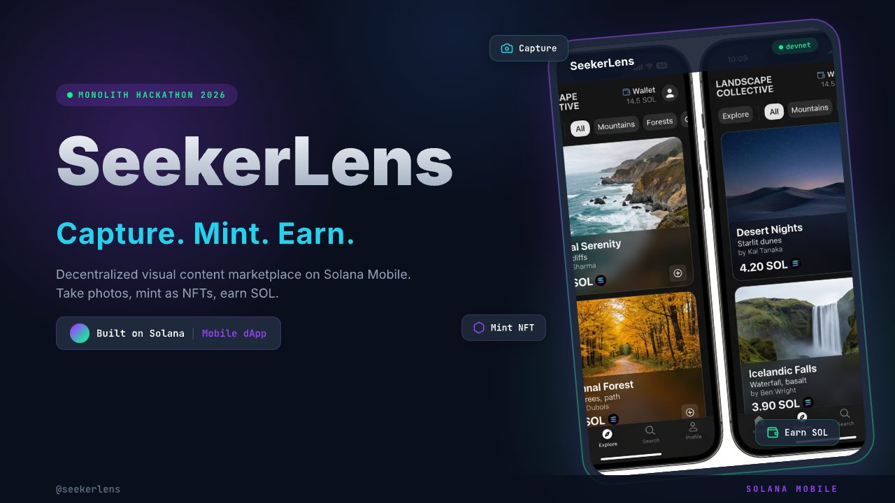

<div align="center">



# SeekerLens

**Capture. Mint. Earn.**

**A decentralized visual content marketplace and bounty platform powered by Solana Mobile**

[](https://opensource.org/licenses/MIT)
[](https://expo.dev/)
[](https://solanamobile.com/)
[](../../releases)

[Download APK](#download-apk) • [Features](#features) • [How It Works](#how-it-works) • [Tech Stack](#tech-stack) • [Quick Start](#quick-start)

</div>

---

## Hackathon Highlights

> **Built for MONOLITH Solana Mobile Hackathon 2026**

| Criteria | Implementation |
|----------|---------------|
| **Functional Android APK** | [Download from Releases](../../releases) |
| **Solana Mobile Stack** | MWA, Compressed NFTs (Bubblegum), SOL transfers |
| **Mobile-First** | Native React Native + Expo — zero web wrappers |
| **Meaningful On-Chain** | cNFT minting, license purchasing, bounty payments |
| **42+ Source Files** | Modular architecture, feature-organized |

---

## Overview

**SeekerLens** turns every Seeker device into a money-making camera. Photographers earn SOL by fulfilling location-based photo bounties or selling licensed content — all verified on-chain.

### The Problem

Traditional stock photography is broken:

| Pain Point | Impact |
|---|---|
| Platforms take 40-60% commission | Creators lose, buyers overpay |
| No way to request specific content at specific locations | Brands settle for generic |
| Zero provenance — no proof of authenticity | Buyers can't verify |
| Payments take 30-90 days | Creators wait months |

### Our Solution

Three pillars. One platform:

1. **Bounty Board** — Anyone posts a photo request with a SOL reward. Nearby photographers fulfill it, get paid instantly.
2. **Content Marketplace** — Creators list photos with tiered licenses. Buyers acquire with SOL, recorded on-chain.
3. **Discovery Feed** — Trending content, top creators, and open bounties for organic growth.

---

## Features

### Core Features

| Feature | Description |
|---------|-------------|
| **In-App Camera** | Live GPS tagging with reverse geocoding |
| **NFT Minting** | One-tap compressed NFT via Metaplex Bubblegum (~$0.001/mint) |
| **Tiered Licensing** | Personal (0.05 SOL) / Commercial (0.5 SOL) / Exclusive (2.0 SOL) |
| **Bounty System** | Create, fund, browse, fulfill, approve & pay — full lifecycle |
| **Wallet Integration** | Mobile Wallet Adapter — native one-tap transactions |
| **Profile Gallery** | NFT collection + earnings dashboard |
| **Network Toggle** | Devnet/mainnet switch for seamless testing |

### Solana Mobile Integration

SeekerLens leverages the **full Solana Mobile Stack**:

| Capability | How SeekerLens Uses It |
|---|---|
| **Mobile Wallet Adapter** | One-tap wallet connect, sign transactions natively |
| **Compressed NFTs (Bubblegum)** | Mint photos as NFTs for fractions of a cent |
| **Sub-second finality** | Bounty payments and license purchases settle instantly |
| **Seeker device camera** | Purpose-built for mobile content creation |
| **dApp Store distribution** | Native Android app, not a web wrapper |

---

## How It Works

### Bounty Flow

```
Photographer sees bounty → Opens camera → GPS auto-tags →
Captures photo → Mints as compressed NFT → Submits →
Bounty creator approves → SOL transfers instantly
```

### Marketplace Flow

```
Creator posts photo → Sets license prices → Photo minted as cNFT →
Buyer browses marketplace → Acquires license → SOL to creator →
License recorded on-chain
```

> Every photo = an NFT. Every transaction = on Solana. Every license = verifiable.

---

## Architecture

```
┌─────────────────────────────────────────────────────────────────┐
│                    React Native + Expo (Mobile)                  │
│  ┌──────────┐  ┌──────────┐  ┌──────────┐  ┌──────────────────┐│
│  │  Home    │  │ Explore  │  │ Camera   │  │    Profile       ││
│  │  Feed    │  │ Bounties │  │ + GPS    │  │    Gallery       ││
│  └────┬─────┘  └────┬─────┘  └────┬─────┘  └────────┬─────────┘│
│       │             │             │                  │          │
│       ▼             ▼             ▼                  ▼          │
│  ┌──────────────────────────────────────────────────────────┐  │
│  │            Mobile Wallet Adapter (MWA)                    │  │
│  │  • transact() • signTransaction() • signMessage()        │  │
│  └────────────────────────┬─────────────────────────────────┘  │
└───────────────────────────┼─────────────────────────────────────┘
                            │
                            ▼
┌─────────────────────────────────────────────────────────────────┐
│                     Solana Network (Devnet)                      │
│  ┌──────────────────────────────────────────────────────────┐   │
│  │  • Compressed NFTs (Bubblegum)  — photo → cNFT           │   │
│  │  • SOL Transfers               — bounty & license pay    │   │
│  │  • On-chain Records            — license ownership        │   │
│  └──────────────────────────────────────────────────────────┘   │
└─────────────────────────────────────────────────────────────────┘
         ▲                                          │
         │                                          ▼
┌────────┴────────────────────────────────────────────────────────┐
│                         Supabase                                 │
│  • Users, bounties, content, licenses                           │
│  • Content discovery & search                                    │
│  • Storage fallback for images                                   │
└─────────────────────────────────────────────────────────────────┘
         ▲
         │
┌────────┴────────────────────────────────────────────────────────┐
│                     IPFS via Pinata                               │
│  • Photo storage                                                 │
│  • NFT metadata hosting                                          │
└─────────────────────────────────────────────────────────────────┘
```

---

## Tech Stack

### Mobile App

- **React Native + Expo** — Custom dev build (not Expo Go)
- **TypeScript** — Type safety across all 42+ files
- **Expo Router** — File-based navigation
- **Zustand** — Global state with AsyncStorage persistence

### Blockchain

- **Solana Web3.js** — Core blockchain interactions
- **Mobile Wallet Adapter** — Native wallet UX
- **Metaplex Bubblegum** — Compressed NFT minting
- **react-native-quick-crypto** — Crypto polyfill

### Backend & Storage

- **Supabase** — PostgreSQL for users, bounties, content, licenses
- **Pinata** — IPFS uploads for photos and NFT metadata
- **expo-camera + expo-location** — Camera and GPS

---

## Download APK

| Source | Link |
|--------|------|
| **GitHub Releases** | [Download Latest](../../releases) |
| **Google Drive** | [Download Folder](https://drive.google.com/drive/folders/1_WOr0G9YvorhFW9VPr1X4vbeU5BrQbGC?usp=sharing) |

---

## Quick Start

### Prerequisites

- Node.js v18+
- Android device or emulator
- Phantom wallet (or any Solana wallet)

### 1. Clone Repository

```bash
git clone https://github.com/cryptoeights/SeekerLens.git
cd SeekerLens
```

### 2. Install Dependencies

```bash
npm install
```

### 3. Environment Setup

```bash
cp .env.example .env
# Fill in Supabase and Pinata credentials
```

### 4. Supabase Setup

- Create a project at [supabase.com](https://supabase.com)
- Run `docs/supabase-schema.sql` in the SQL Editor
- Create a public storage bucket named `content`

### 5. Build & Run

```bash
npx expo prebuild
eas build --profile development
```

---

## Project Structure

```
app/                    # Screens (Expo Router)
  (tabs)/               # Bottom tabs — Home, Explore, Create, Profile
  bounty/               # Bounty detail, create, manage submissions
  content/              # Content detail, post to marketplace
  camera.tsx            # Camera with GPS auto-tagging
  onboarding.tsx        # Wallet connect onboarding
  settings.tsx          # Network toggle, wallet info
components/             # Reusable UI components
  ui/                   # Primitives (Button, Card, Tag, Avatar, etc.)
  home/                 # Home screen components
  profile/              # Profile components
  wallet/               # Wallet connect button
hooks/                  # Custom hooks
  useWallet.ts          # MWA wallet connection
  useNFT.ts             # Compressed NFT minting
  useLicense.ts         # License purchase + SOL transfer
lib/                    # Core libraries
  api/                  # Supabase API helpers (bounties, content, licenses)
  nft.ts                # Bubblegum cNFT minting
  storage.ts            # IPFS upload via Pinata
  solana.ts             # Solana connection helpers
  supabase.ts           # Supabase client
  constants.ts          # Design tokens
  types.ts              # TypeScript domain types
store/                  # Zustand global store
```

---

## Innovation

What makes SeekerLens different from anything else:

| Innovation | Description |
|---|---|
| **Location-Based Photo Bounties** | Nobody else does this on-chain. Uber for photography meets Shutterstock on Solana. |
| **GPS + Timestamp in NFT Metadata** | Cryptographic proof of where and when every photo was taken. |
| **Tiered Licensing On-Chain** | Personal, commercial, exclusive licenses as Solana transactions — not database entries. |
| **Compressed NFTs** | Minting costs ~$0.001 instead of $2+. Every casual photo can be an NFT. |
| **Two-Sided Marketplace** | Both supply (marketplace) and demand (bounties) from day one — self-reinforcing flywheel. |

---

## Roadmap

- [x] Bounty board — create, browse, fulfill, approve & pay
- [x] Content marketplace — post, license, purchase
- [x] Compressed NFT minting via Bubblegum
- [x] In-app camera with GPS auto-tagging
- [x] Mobile Wallet Adapter integration
- [x] On-chain license purchasing
- [x] Profile gallery & earnings dashboard
- [ ] On-chain escrow via Anchor program
- [ ] Video content support
- [ ] GPS radius verification
- [ ] Creator reputation system
- [ ] SKR token economy
- [ ] iOS support

---

## License

This project is licensed under the MIT License.

---

<div align="center">

**Built solo. Built mobile-first. Built for the Seeker community.**

**[Back to Top](#seekerlens)**

</div>
